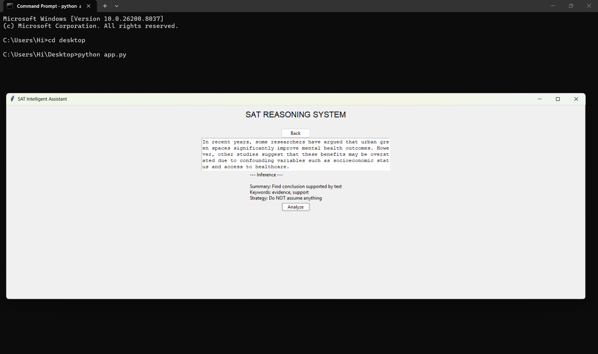
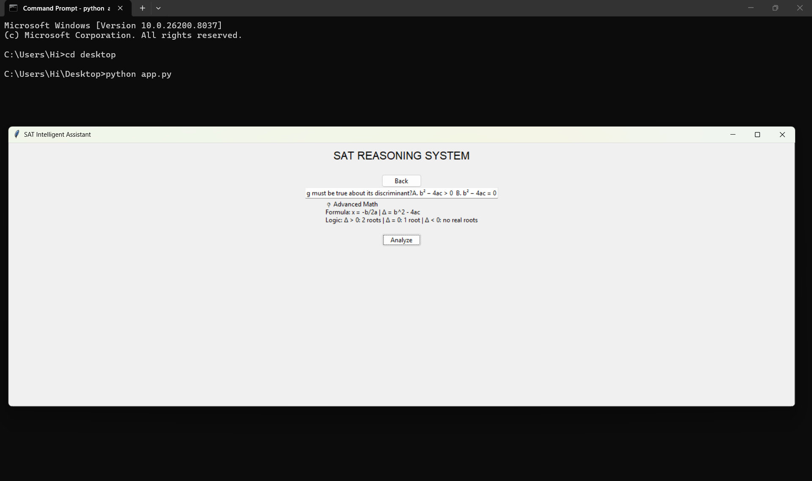

# sat-reasoning-assistant
This project was built around a simple question:
How can structured thinking be translated into a working system?
Instead of focusing on generating answers, this application focuses on modeling the reasoning process behind solving SAT questions. It uses a rule-based approach to identify patterns in both Verbal and Math tasks, then guides the user through strategic thinking rather than immediate solutions.

## Design Philosophy
The system is intentionally simple.
Rather than relying on complex models or hidden logic, every decision is traceable. Each output is the result of explicit rules, making the reasoning process transparent and interpretable.
This reflects an interest in systems where clarity matters more than complexity.

## What it does
- Classifies SAT question types based on patterns in input
- Provides strategic hints before revealing answers
- Encourages step-by-step reasoning instead of guesswork
- Applies basic heuristic matching for Math concepts

## Preview
### Verbal Analysis

### Math Detection


## Why this project exists
This project is not meant to be a complete solution.
It is a small experiment in turning abstract reasoning into a functional system, showing how logic, structure, and decision-making can be encoded into software.

## Technical Approach
- Rule-based keyword detection
- Pattern matching using regular expressions
- Simple GUI built with Tkinter
- No external APIs or black-box models

## Running the Application
1. Install Python 3.x  
2. Download the `app.py` file  
3. Run the following command:
```bash
python app.py
```

## Author
Da Ngoc Hoang
